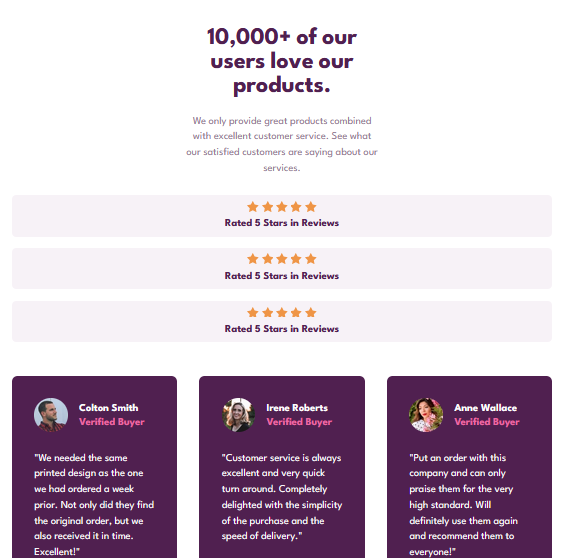

# Frontend Mentor - Social proof section solution

This is a solution to the [Social proof section challenge on Frontend Mentor](https://www.frontendmentor.io/challenges/social-proof-section-6e0qTv_bA). Frontend Mentor challenges help you improve your coding skills by building realistic projects.

## Table of contents

- [Overview](#overview)
  - [The challenge](#the-challenge)
  - [Mobile Screenshot](#mobile-screenshot)
  - [Tablet Screenshot](#tablet-screenshot)
  - [Desktop Screenshot](#desktop-screenshot)
  - [Links](#links)
- [My process](#my-process)
  - [Features](#features)
  - [What I learned](#what-i-learned)
- [Author](#author)

## Overview

### The challenge

Users should be able to:

- View the optimal layout depending on their device's screen size
- See hover and focus states for interactive elements

### Mobile Screenshot

### Tablet Screenshot

### Desktop Screenshot

### Links

- Live Site URL: [Social Proof Section Page](https://fem-social-proof-mu.vercel.app/)

## My process

### Features

- Responsive layout using **CSS Grid** and **Flexbox**
- **Reusable components**: rating blocks, media object, and comment cards
- Custom **Google Fonts integration** (League Spartan)
- Fluid typography using `clamp()`
- Accessible and semantic HTML structure

### What I learned

- How to structure a **social proof section** with hero, ratings, and testimonials
- Building **flexible media components** (avatar + text)
- Managing spacing/alignment with **utility-like classes** (`us-small`, `us-medium`)
- Creating **fluid, responsive typography** with `clamp()`
- Using **CSS variables** for consistent color theming

## Author

Github - [Lewis](https://github.com/Lewis-mbui)
